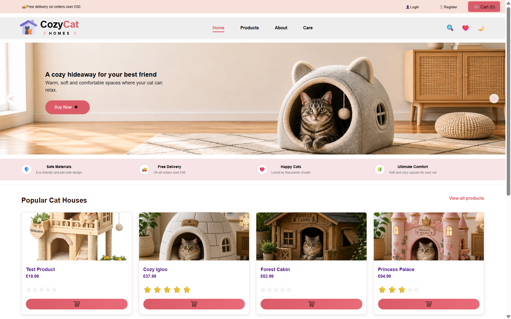
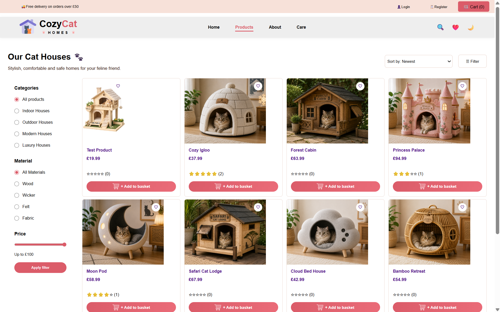
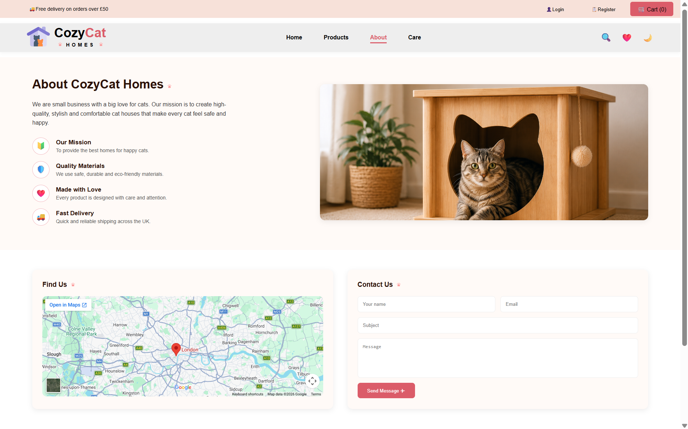
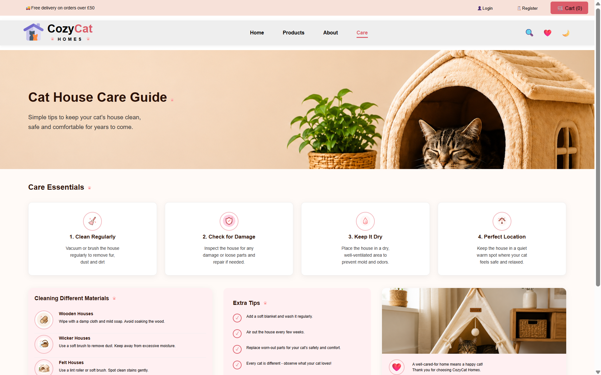
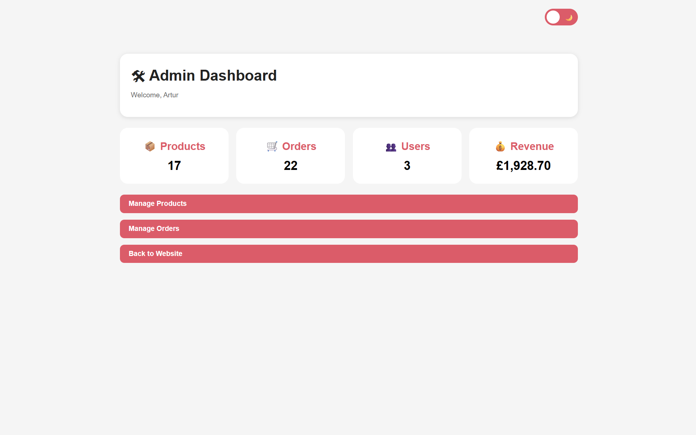
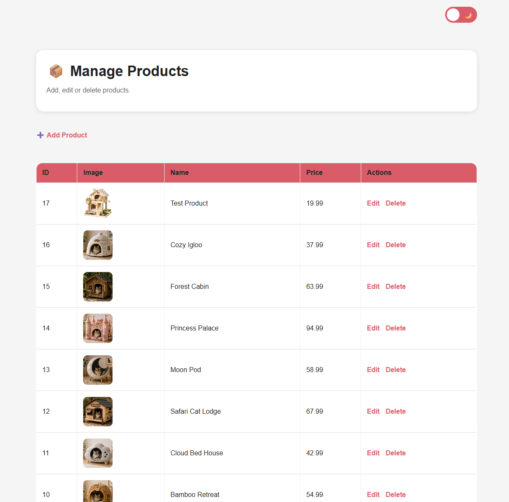
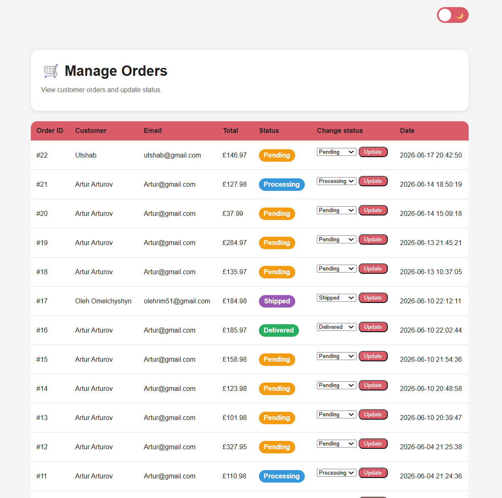
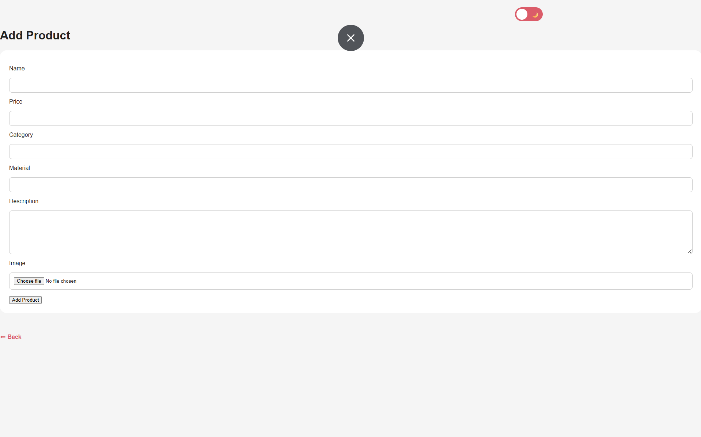

# 🐾 CozyCat Homes

Responsive e-commerce website for premium cat houses and accessories.

---

## ✨ Features

- User registration and login
- Shopping cart
- Favorites
- Product reviews
- Search products
- Dark mode
- Responsive design
- Admin panel
- Order history
- Categories

---

## 🛠 Technologies

- HTML5
- CSS3
- JavaScript
- PHP
- MySQL

---

## 📄 Pages

- Home
- Products
- Product Details
- About
- Care
- Account
- My Orders
- Checkout
- Admin Dashboard

---

## 📱 Responsive Design

- Desktop
- Tablet
- Mobile

---

## 👨‍💻 Author

Oleh Omelchyshyn

Bedford, United Kingdom

---

## 🚀 Project Status

In development

## 📸 Screenshots

### 🏠 Home Page

### 🛍 Products Page

### 📄 About

### 📦 Care 

### ⚙️ Admin Dashboard

### Ⓜ️ Manage product

### ©️ Manage Orders

### ➕ Add prodact

